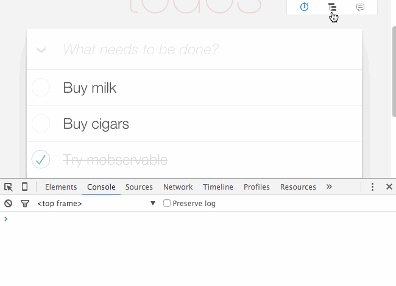

## React Developer Tools
The React Developer Tools are available as [Chrome](https://chrome.google.com/webstore/detail/react-developer-tools/fmkadmapgofadopljbjfkapdkoienihi) and [Firefox](https://addons.mozilla.org/de/firefox/addon/react-devtools) extension that allows to inspect a React tree, including the component hierarchy that were rendered on the page and to show- and modify props and state. It can be opened by switching to the new added tab in the [Chrome](https://developer.chrome.com/devtools)- or [Firefox](https://developer.mozilla.org/en-US/docs/Tools) developer tools.

## MobX DevTools
The [MobX DevTools](https://mobx.js.org/best/devtools.html) can be used to track the rendering behavior and timing, data depenencies and store mutations. It is added as NPM development dependency by default, but must be added to the application locally.



To enable the package and render the toolbar add the import and provided class to the code base where the recommended entry point for communikey is the `BaseLayout.js` class:

```js
import DevTools from "mobx-react-devtools";
//...
const renderBaseLayout = () => (
  <Layout>
    //...
  </Layout>
  <DevTools/>
  //...
)
```

Details and configuration options can be found in the `mobx-react-devtools` [GitHub repository](https://github.com/mobxjs/mobx-react-devtools).
