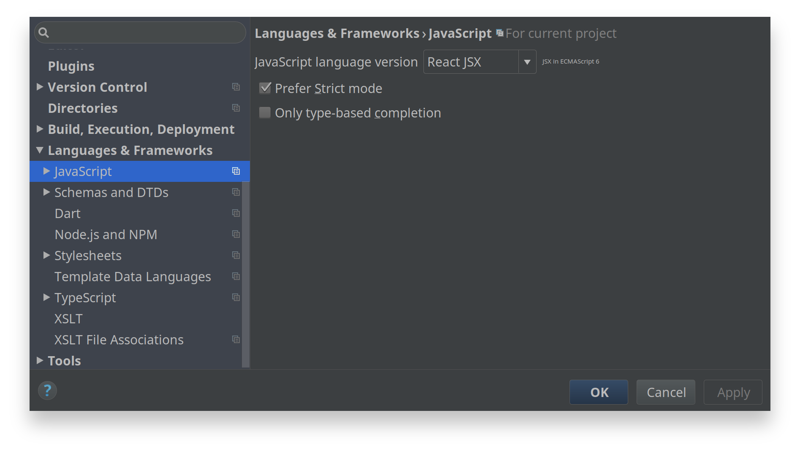

The project supports [WebStorm](https://jetbrains.com/webstorm) by including `.idea` settings. The following settings are recommended to achieve a optimal development setup. 

## JavaScript Language Version
Set the project JavaScript language version to the current [React JSX](https://facebook.github.io/react/docs/jsx-in-depth.html) syntax ()[ECMAScript 6](http://www.ecma-international.org/ecma-262/6.0) specification) for the [Babel](https://babeljs.io) compiler at *Settings > Languages & Frameworks > JavaScript*.

## Libraries
Enable autocompletion- and coding assistance support for NPM dependencies by adding supported libraries to the list at *Settings > Languages & Frameworks > JavaScript > Libraries*.

## NodeJS Core Library Coding Assistance
Enable the NodeJS core library coding assistance at *Settings > Languages & Frameworks > JavaScript > Node.js and NPM*.

## ESLint
Enable the ESLint support at *Settings > Languages & Frameworks > JavaScript > Code QUality Tools > ESLint* for live linting features.

