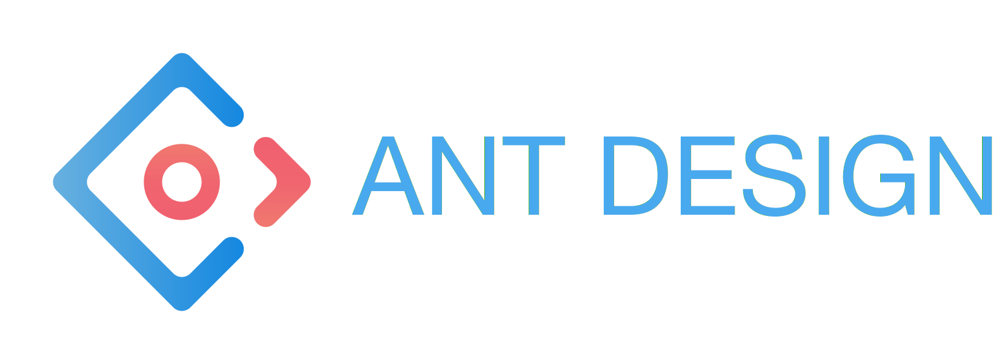
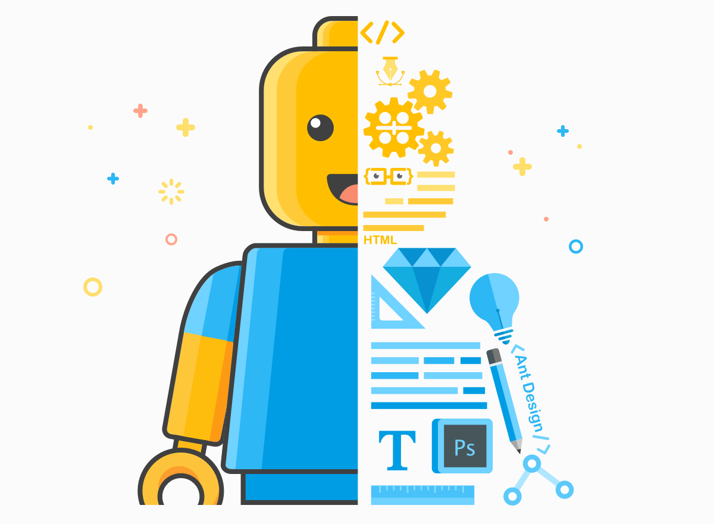

## 
[NodeJS](https://nodejs.org) is the JavaScript runtime built on [Chrome's V8 JavaScript engine](https://developers.google.com/v8) which powers the communikey UI. It uses an event-driven, non-blocking I/O model that makes it lightweight and efficient. The package ecosystem [npm](https://npmjs.com) is the largest ecosystem of open source libraries in the world.

The currently tested and supported version is [{{book.technologies.node.version}}](https://nodejs.org/download/release/v6.5.0).

## 
[React](https://facebook.github.io/react) is the [reactive](http://reactivemanifesto.org) JavaScript library used to build the interactive and declarative UI components. It manages application states and efficiently updated and renders just the right components when data changes. The design pattern is to build encapsulated components that manage their own state, then compose them to make complex UIs with the ability to easily pass rich data through the application and keep state out of the DOM.

The currently tested and supported version is [{{book.technologies.react.version}}](https://npmjs.com/package/react).

## 
[Ant Design](https://ant.design) is the UI design project which provides high quality and uniform [React UI components](https://ant.design/docs/react/introduce). It is created with well thought design [guidelines- and specificatins](https://ant.design/docs/spec/introduce) similar to Google's Material Design.

Next to the JavaScript library desktop- and [mobile](https://mobile.ant.design) implementations, [Ant Motion](https://motion.ant.design), [AntV](https://antv.alipay.com) and the [Scaffold Market](http://scaffold.ant.design) are the [Ant UX](http://ux.ant.design) resources for designers with UI mockup template applications like Sketch and Axure.

The currently tested and supported version is [{{book.technologies.antd.version}}](https://npmjs.com/package/react).
